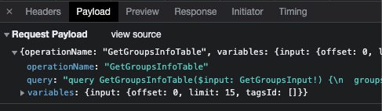
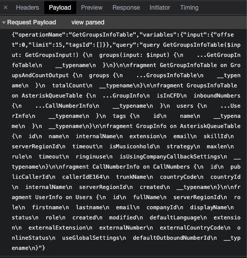

# Format GraphQL Payload

If you're trying to copy a GraphQL query which got extracted from the Network panel in the browser in order to paste it into the GraphQL Playground so that you can debug it, that might get a bit complicated if the query is too big.

The query is stringified:



And if you click on "view source", that doesn't help much:



## Usage

- Install the dependencies

```
npm i
```

- Click on "view sorce" in the Network panel and copy the whole request payload for the GraphQL query

- Save it to a .txt file

- Run this script informing the input and output paths

```
npm start ./plain-text-payload.input.txt ./output.txt
```

- In the output file you'll see it formatted and ready to be used
